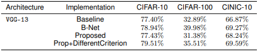

#  Differentiable Branching in Deep Networks for Fast Inference.
Project developed for the course "Advanced topics in Machine Learning" at Università della Svizzera Italiana.
The aim of the project is a reproducibility challenge of the paper ["Differentiable branching in deep networks for fast inference"](https://ieeexplore.ieee.org/document/9054209) [[1]](#1) by professor S. Scardapane et al., DIET Department, Sapienza University of Rome.

 

# Abstract
In recent years, one notable advancement in the deep learning field has been the introduction of
models that incorporate multiple auxiliary branches for early exiting during inference. This project
aims to reproduce the findings of a seminal paper that proposed a novel algorithm for end-to-end
training of neural networks, without having to fine-tune manually all the parameters of the auxiliary
branches. We will re-implement the algorithm as described in the paper and apply it to a range
of classification tasks, using the publicly available datasets that are also used in the original paper.
Through this reproducibility project, we aim to provide valuable insights into the practical applicability
and generalizability of the proposed algorithm in real-world classification tasks.

 

# Model Architecture 
We implemented the VGG-13 architecture. We did 4 structures: the standard VGG-13 (our baseline), then the [B-NET](https://ieeexplore.ieee.org/abstract/document/7900006) ([[2]](#2)), the authors proposed methodology (our interpretation) and the same with a different criterion that we tried.  

 

# Results
Table 1 shows the results of the test accuracy on the VGG-13 architecture using CIFAR10 and CIFAR100 datasets. Likewise to the paper, better test accuracy were obtained using the CIFAR10 dataset, while CIFAR-100 achieved the worst results. We were only able to obtain similar test accuracy to the one in the paper for CIFAR-10. We believe a number
of factor comes into play, such the paper not giving enough details for some of the architecture implementation they used.   

We wanted to go into more detail like shown in the paper, so we decided to detail the average test accuracy the inference time and the speed up based on the experiment of VGG-13 using CIFAR10 dataset. This is shown in
Table 2. We would like to emphasise that the reason our inference time differs from by a large amount is because of the difference in machine with the paper.  

 

# References
<a id="1">[1]</a> 
S. Scardapane, D. Comminiello, M. Scarpiniti, E. Baccarelli and A. Uncini, "Differentiable Branching In Deep Networks for Fast Inference," ICASSP 2020 - 2020 IEEE International Conference on Acoustics, Speech and Signal Processing (ICASSP), Barcelona, Spain, 2020, pp. 4167-4171, doi: 10.1109/ICASSP40776.2020.9054209.
 
<a id="2">[2]</a>
S. Teerapittayanon, B. McDanel and H. T. Kung, "BranchyNet: Fast inference via early exiting from deep neural networks," 2016 23rd International Conference on Pattern Recognition (ICPR), Cancun, Mexico, 2016, pp. 2464-2469, doi: 10.1109/ICPR.2016.7900006.
